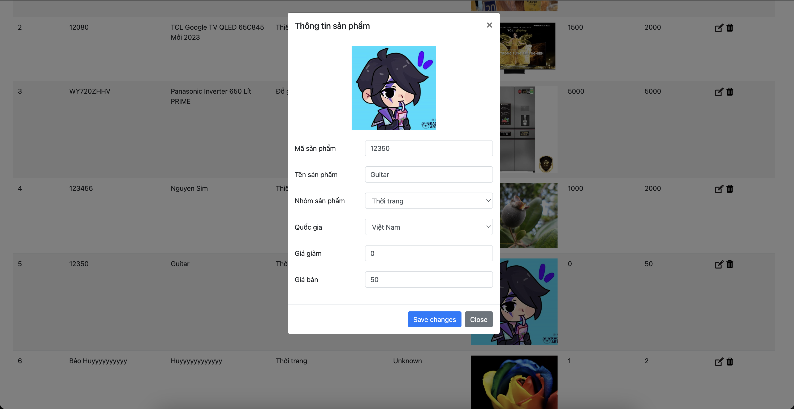
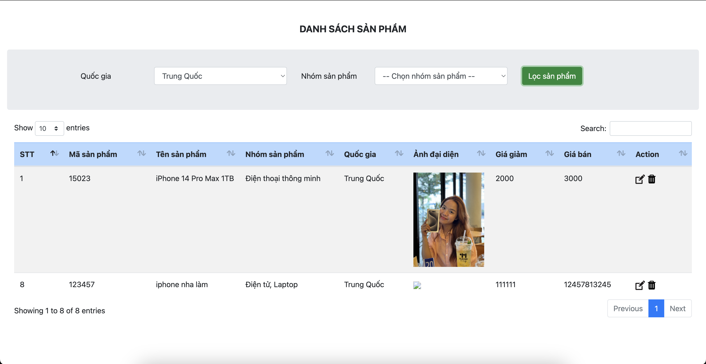

# README - Quản Lý Sản Phẩm

## 1. Giải thích Code Các Method Đã Viết

### `fetchAllCountries()`
- **Mô tả**: Gửi một yêu cầu AJAX đến API để lấy danh sách các quốc gia.
- **Chức năng**: Khi thành công, phương thức gọi `loadCountriesToSelect` để xử lý dữ liệu nhận được.

### `loadCountriesToSelect(countryData)`
- **Mô tả**: Nhận dữ liệu danh sách quốc gia và gọi `createCountryOption` để tạo và thêm các tùy chọn vào dropdown.
- **Chức năng**: Xử lý dữ liệu quốc gia và cập nhật dropdown của quốc gia và quốc gia chỉnh sửa.

### `createCountryOption(index, country)`
- **Mô tả**: Tạo phần tử tùy chọn (`<option>`) cho dropdown và thêm vào các phần tử dropdown tương ứng.
- **Chức năng**: Thêm tùy chọn quốc gia vào các dropdown của thêm và chỉnh sửa quốc gia.

### `fetchAllCategories()`
- **Mô tả**: Gửi yêu cầu AJAX để lấy danh sách các danh mục.
- **Chức năng**: Khi thành công, phương thức gọi `loadCategoriesToSelect` để xử lý dữ liệu nhận được.

### `loadCategoriesToSelect(categoryData)`
- **Mô tả**: Nhận dữ liệu danh sách danh mục và gọi `createCategoryOption` để tạo và thêm các tùy chọn vào dropdown.
- **Chức năng**: Xử lý dữ liệu danh mục và cập nhật dropdown của danh mục.

### `createCategoryOption(index, category)`
- **Mô tả**: Tạo phần tử tùy chọn (`<option>`) cho dropdown và thêm vào dropdown của danh mục.
- **Chức năng**: Thêm tùy chọn danh mục vào dropdown.

### `fetchAllProducts()`
- **Mô tả**: Gửi yêu cầu AJAX để lấy danh sách các sản phẩm.
- **Chức năng**: Khi thành công, phương thức gọi `loadProductsToTable` để xử lý dữ liệu nhận được và cập nhật bảng sản phẩm.

### `loadProductsToTable(productData)`
- **Mô tả**: Xóa dữ liệu hiện tại trong bảng và thêm dữ liệu sản phẩm mới.
- **Chức năng**: Cập nhật bảng sản phẩm với dữ liệu mới.

### `generateIndex()`
- **Mô tả**: Tạo chỉ số cho mỗi hàng trong bảng sản phẩm.
- **Chức năng**: Tăng chỉ số mỗi khi hàng mới được tạo.

### `loadProductInfo(button)`
- **Mô tả**: Tải thông tin sản phẩm vào các trường chỉnh sửa khi nút chỉnh sửa được nhấn.
- **Chức năng**: Hiển thị thông tin chi tiết của sản phẩm trong modal chỉnh sửa.

### `filterProduct()`
- **Mô tả**: Lọc các hàng sản phẩm dựa trên tiêu chí lọc (quốc gia, danh mục).
- **Chức năng**: Hiển thị hoặc ẩn các hàng trong bảng dựa trên các tiêu chí lọc.

## 2. Mô Tả Dự Án

Dự án "Quản Lý Sản Phẩm" là một ứng dụng web cho phép người dùng quản lý danh sách sản phẩm, bao gồm các tính năng như chỉnh sửa, và lọc sản phẩm theo các tiêu chí như quốc gia và danh mục. 

Ứng dụng cung cấp giao diện người dùng thân thiện để thực hiện các chức năng quản lý sản phẩm và sử dụng các công nghệ web hiện đại để đảm bảo hiệu suất và trải nghiệm người dùng tốt.

## 3. Các Chức Năng

### Chỉnh Sửa Sản Phẩm
- **Mô tả**: Cho phép người dùng chỉnh sửa thông tin sản phẩm đã tồn tại.
- **Ảnh chụp**:
  

### Lọc Sản Phẩm
- **Mô tả**: Cho phép người dùng lọc sản phẩm theo quốc gia và danh mục.
- **Ảnh chụp**:
  

## 4. Công Nghệ Sử Dụng

- **HTML/CSS**: Để xây dựng giao diện người dùng.
- **JavaScript/jQuery**: Để xử lý các tương tác và yêu cầu AJAX.
- **Bootstrap**: Để thiết kế giao diện responsive và các thành phần UI.
- **DataTables**: Để hiển thị và quản lý dữ liệu trong bảng.
- **AJAX**: Để giao tiếp với API và xử lý dữ liệu động.

